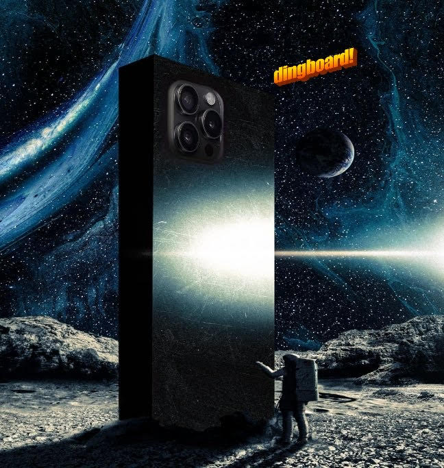
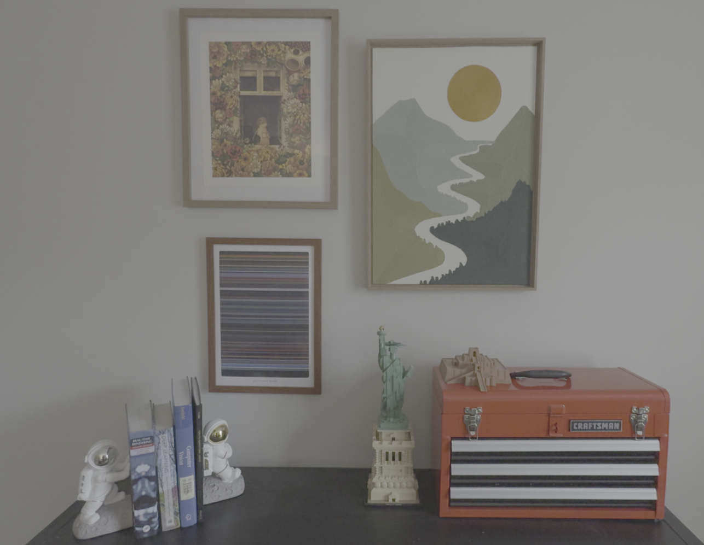

<p align="center">
  
</p>


Apple ProRes Log video format captures minimally processed 10 bit HDR video up to 4K 30FPS on iPhone 15 and 16 Pros. The videos are radiometrically and geometrically calibrated by Apple on device. This makes ProRes Log video one of the easiest ways to get film quality calibrated video for photogrammetry, radiance fields, VFX, and so on without needing a full frame camera and manual calibrations. Apple promises that after decoding from log to linear, the image values represent linear scene reflectance, which is usually hard to get on iPhones due to all the computational photography processing. This repo implements the log to linear decoding based on the [Apple Log Profile White Paper](Apple_Log_Profile_White_Paper.pdf).

## Applications

<p align="center">Bypass Apple's computational photography for improved radiometry:</p>
<p align="center">(less denoising, sharpening, color correction, and other undocumented processing), zoom in for details</p>

<p align="center">
  
</p>


<p align="center">HDR imaging:</p>
<p align="center">
  
</p>


## How to turn on ProRes Log video format

Go to `Settings->Camera->Formats` and at the bottom turn on Apple ProRes and select Log from ProRes Encoding. When you open the camera app, you should see `ProRes LOG` in the top left if it is on. At 4K 30FPS, a 1 minute video is around 6GB. 

<p align="center">The video color will look flat during capture due to the log encoding:</p>
<p align="center">
  
</p>


## Recommended steps for improved radiometry
* Use the 0.5x ultrawide camera with locked auto exposure and locked auto focus while underexposing to prevent motion blur. To do this, hold down on the screen when the camera app is open and the `AE/AF` will lock, which locks the auto exposure and auto focus. Unfortunately it is not possible to lock one of focus or exposure, they both have to be locked. Using the 0.5x ultrawide camera has the largest depth of field which helps prevent being out of focus when locking. Scrolling down on the exposure slider will decrease motion blur by shortening exposure. I find it beneficial to deliberately underexpose for most scenes, there is usually enough signal and it decreases motion blur. 
* Turn on `Lock Camera` and `Lock White Balance` in `Settings->Camera->Record Video`
* Turn on `Lens Correction` in `Settings->Camera` for undistortion

## Optional Color Correction
Per the white paper, the images are in Linear REC.2020 after decoding. If you want more visually appealing images, at the expense of a compressed color range, use `--apply_ccm` to convert from Linear Rec.2020 to Linear Rec.709. The 8 bit images will still have gamma correction applied to them. Here is the difference between the two:
 <p align="center">
  
</p>

  
## Instructions

Non standard dependencies to install:
* `pip install av`
* `pip install opencv-python`

Capture the video and then download the .MOV file from your phone to your computer. It is fastest to transfer over usb wire but google drive can be used at slower speed. A sample video is provided.

```bash
python apple-log2linear.py --base_directory . --mov_file IMG_2910.MOV 
```

Run the following to see all command line options:
```bash
python apple-log2linear.py -h
```

The data is saved to 3 folders inside the generated `tmp` folder:
* `images` - 8 bit gamma corrected and clipped for COLMAP etc
* `images-16bit` - 16 bit PNG with clipped linear 10 bit data for ease of use
* `images-32bit` - 32 bit EXR with unclipped linear 10 bit data for maximum fidelity


